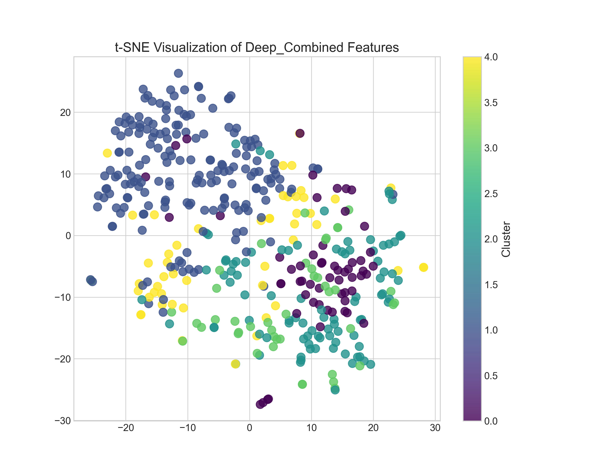

# Multiview Clustering Analysis of Islamic Geometric Patterns

## 1. Overview

- **Dataset**: 431 images from data/morocco
- **Clustering Method**: Multiview consensus clustering
- **Feature Types**: Color, Texture, Deep_VGG16, Deep_ResNet50, Deep_EfficientNet, Deep_MobileNet, Deep_DenseNet, Deep_Combined, Symmetry
- **Number of Clusters**: 5

## 2. Feature Analysis

### Color Features

- **Dimension**: 96
- **Optimal k**: 5
- **Silhouette Score**: 0.2397

### Texture Features

- **Dimension**: 1577
- **Optimal k**: 2
- **Silhouette Score**: 0.1496

### Deep_VGG16 Features

- **Dimension**: 512
- **Optimal k**: 2
- **Silhouette Score**: 0.1752

### Deep_ResNet50 Features

- **Dimension**: 2048
- **Optimal k**: 2
- **Silhouette Score**: 0.0455

### Deep_EfficientNet Features

- **Dimension**: 1280
- **Optimal k**: 2
- **Silhouette Score**: 0.0589

### Deep_MobileNet Features

- **Dimension**: 1280
- **Optimal k**: 2
- **Silhouette Score**: 0.0627

### Deep_DenseNet Features

- **Dimension**: 1024
- **Optimal k**: 2
- **Silhouette Score**: 0.0942

### Deep_Combined Features

- **Dimension**: 6144
- **Optimal k**: 2
- **Silhouette Score**: 0.0538

### Symmetry Features

- **Dimension**: 8
- **Optimal k**: 2
- **Silhouette Score**: 0.3407

## 3. Consensus Matrix

The consensus matrix represents the agreement between different feature views on which pairs of patterns should be clustered together.

## 3.5. Agreement Between Views (ARI)

The Adjusted Rand Index (ARI) measures the agreement between different clustering views and the final consensus clustering.

The Deep_Combined features show the highest agreement with the final consensus clustering (ARI = 0.46), while Symmetry features show the lowest agreement (ARI = 0.07).

## 4. Clustering Results

### Cluster Summary

| Cluster | Count | % of Dataset | Key Characteristics |
|---------|-------|-------------|---------------------|
| 0 | 58 | 13.5% | v_flip symmetry: 0.83 |
| 1 | 186 | 43.2% | No dominant characteristics |
| 2 | 93 | 21.6% | No dominant characteristics |
| 3 | 44 | 10.2% | 30 symmetry: 1.07, 45 symmetry: 0.87, 60 symmetry: 0.85 |
| 4 | 50 | 11.6% | No dominant characteristics |

## 5. Detailed Cluster Analysis

### Cluster 0

- **Count**: 58 images (13.5% of dataset)
- **Representative patterns**: mor_2813x.jpg, mor_0603.jpg, mor_1509.jpg, mor_0429.jpg, mor_0616.jpg
- **Symmetry analysis**:
  - 30: -0.36
  - 45: -0.44
  - 60: -0.48
  - 90: -0.25
  - 120: -0.52
  - 180: 0.10
  - h_flip: -0.21
  - v_flip: 0.83

### Cluster 1

- **Count**: 186 images (43.2% of dataset)
- **Representative patterns**: mor_0818.jpg, mor_0617.jpg, mor_0401.jpg, mor_0213.jpg, mor_0207.jpg
- **Symmetry analysis**:
  - 30: -0.23
  - 45: -0.09
  - 60: -0.07
  - 90: -0.07
  - 120: 0.07
  - 180: 0.02
  - h_flip: -0.11
  - v_flip: -0.12

### Cluster 2

- **Count**: 93 images (21.6% of dataset)
- **Representative patterns**: mor_2405x.jpg, mor_4206x.jpg, mor_2413x.jpg, mor_2829x.jpg, mor_2429x.jpg
- **Symmetry analysis**:
  - 30: 0.05
  - 45: -0.02
  - 60: -0.00
  - 90: 0.18
  - 120: -0.08
  - 180: -0.09
  - h_flip: 0.32
  - v_flip: -0.21

### Cluster 3

- **Count**: 44 images (10.2% of dataset)
- **Representative patterns**: mor_0824.jpg, mor_0830.jpg, mor_0428.jpg, mor_0831.jpg, mor_0833.jpg
- **Symmetry analysis**:
  - 30: 1.07
  - 45: 0.87
  - 60: 0.85
  - 90: 0.50
  - 120: 0.70
  - 180: 0.02
  - h_flip: 0.34
  - v_flip: -0.05

### Cluster 4

- **Count**: 50 images (11.6% of dataset)
- **Representative patterns**: mor_4210x.jpg, mor_0415.jpg, mor_0825.jpg, mor_0614.jpg, mor_1132.jpg
- **Symmetry analysis**:
  - 30: 0.24
  - 45: 0.15
  - 60: 0.07
  - 90: -0.23
  - 120: -0.14
  - 180: -0.05
  - h_flip: -0.23
  - v_flip: -0.10

## 6. Conclusion

This analysis demonstrates the effectiveness of multiview clustering for categorizing Islamic geometric patterns. By combining color, texture, deep learning features, and symmetry analysis, we've identified distinctive pattern clusters with specific geometric and visual characteristics.

These results can provide valuable insights for researchers studying Islamic art and architecture, enabling quantitative classification of pattern styles based on their mathematical and visual properties.

